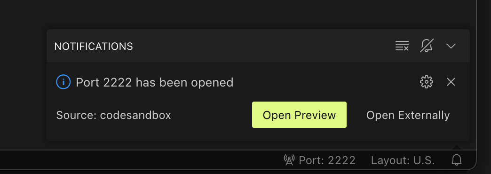

# KOM IGANG

## Installere på min egen computer

1. Installere Visual Studio Code fra [https://code.visualstudio.com/download](https://code.visualstudio.com/download)

2. Installere node.js fra [https://nodejs.org/en/download](https://nodejs.org/en/download)

3. Verificere i en terminal med

   ```sh
   node -v
   ```

   ```sh
   npm -v
   ```

4. Installere express fra en terminal

   ```sh
   npm install express
   ```

5. Installere nodemon fra en terminal

   ```sh
   npm install -g nodemon
   ```

6. Hent kode fra github

   https://github.com/RocketRunner/petstore

7. start node.js server fra en terminal

   ```sh
    nodemon index.js
   ```

8. Åben [http://localhost:8080/](http://localhost:8080/) i din browser


## Installere på https://codesandbox.io/

1. Opret en bruger med dit Google ID på [https://codesandbox.io/](https://codesandbox.io/)

2. Åben kode fra github.com
    [https://codesandbox.io/p/github/RocketRunner/petstore](https://codesandbox.io/p/github/RocketRunner/petstore)

3. Åben preview i din browser
   

